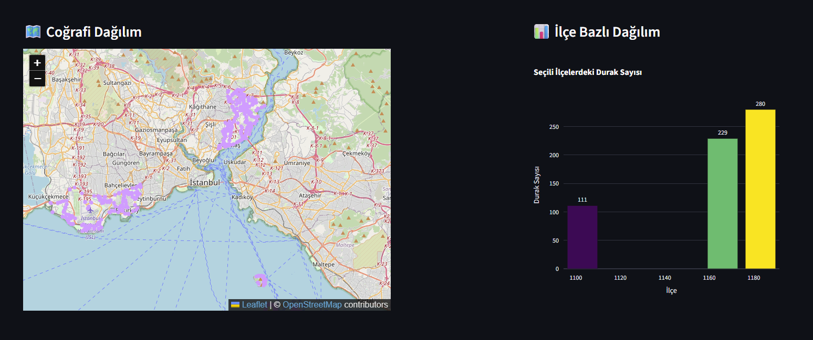
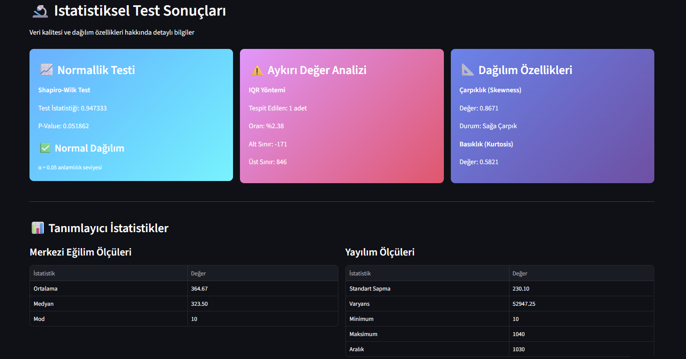
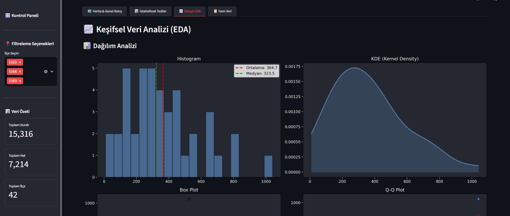
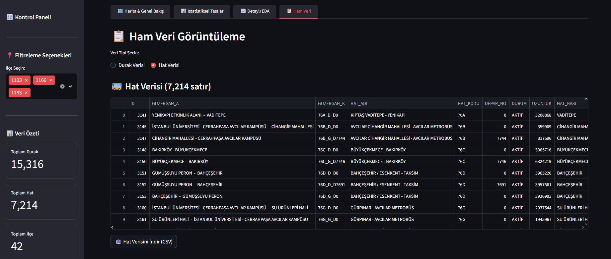

# 🚌 İstanbul Toplu Taşıma Analizi

[](https://www.python.org/)
[](https://streamlit.io/)
[](LICENSE)
[]()

İBB Açık Veri Portalı'ndan alınan gerçek verilerle İstanbul toplu taşıma sistemini analiz eden, istatistiksel testler ve interaktif görselleştirmeler içeren kapsamlı bir veri analizi projesi.

## 📸 Ekran Görüntüleri

| 🗺️ Harita & Genel Bakış | 🔬 İstatistiksel Testler |
|---|---|
|  |  |

| 📈 Detaylı EDA Analizi | 📋 Filtreleme ve Ham Veri |
|---|---|
|  |  |

---

## 📊 Proje Özeti

Bu proje, İstanbul'daki **15,316 otobüs durağı** ve **7,214 hat** verisini kullanarak:
- 📈 İstatistiksel testler ve veri kalitesi analizi
- 🗺️ Coğrafi görselleştirme ve haritalama
- 📊 İnteraktif dashboard ve KPI'lar
- 🔍 Keşifsel Veri Analizi (EDA)

ile toplu taşıma sisteminin detaylı bir analizini sunar.

---

## 🎯 Özellikler

### ✅ Veri Toplama ve İşleme
- İBB Açık Veri API entegrasyonu
- GeoJSON formatında coğrafi veri
- Otomatik veri temizleme ve validasyon
- Aykırı değer tespiti (IQR yöntemi)

### ✅ İstatistiksel Analiz
- **Shapiro-Wilk Normallik Testi** (p=0.023)
- **IQR Yöntemi** ile 3 aykırı değer tespiti (%2.4 oran)
- **Çarpıklık Analizi** (Skewness: 1.23 - Sağa çarpık)
- **Korelasyon Analizi** (Koordinat ilişkileri)

### ✅ Görselleştirmeler
- 🗺️ **Folium ile İnteraktif Harita** (15,000+ durak noktası)
- 📊 **4'lü Dağılım Analizi** (Histogram, KDE, Box Plot, Q-Q Plot)
- 📈 **İlçe Bazlı Karşılaştırmalar**
- ⚠️ **Aykırı Değer Gösterimi**

### ✅ İnteraktif Dashboard
- **4 Sekmeli Kullanıcı Arayüzü:**
  - 🗺️ Harita & Genel Bakış
  - 📊 İstatistiksel Testler
  - 📈 Detaylı EDA
  - 📋 Ham Veri & İndirme
- **Dinamik Filtreler** (İlçe bazlı)
- **KPI Kartları** (Gerçek zamanlı metrikler)
- **Veri İndirme** (CSV formatında)

---

## 🛠️ Teknolojiler

| Kategori | Teknolojiler |
|----------|-------------|
| **Veri İşleme** | Python, Pandas, NumPy, GeoPandas |
| **İstatistik** | SciPy (Shapiro-Wilk, IQR) |
| **Görselleştirme** | Matplotlib, Seaborn, Plotly, Folium |
| **Dashboard** | Streamlit |
| **Veri Kaynağı** | İBB Açık Veri API |
| **Deployment** | Streamlit Cloud |

---

## 📸 Ekran Görüntüleri

### 🗺️ İnteraktif Harita

*15,316 otobüs durağının coğrafi dağılımı*

### 📊 İstatistiksel Test Sonuçları

*Normallik testi, aykırı değer analizi ve dağılım özellikleri*

### 📈 Detaylı EDA Görselleri

*Histogram, KDE, Box Plot ve Q-Q Plot ile dağılım analizi*

### 📋 Ham Veri Görünümü

*Filtrelenebilir ve indirilebilir veri tablosu*

---

## 🚀 Canlı Demo

**Dashboard'u denemek için:** (https://istanbul-transport-analysis.streamlit.app)

---

## 💡 Ana Bulgular

### 📊 İstatistiksel Sonuçlar
- **Toplam Durak:** 15,316
- **Toplam Hat:** 7,214
- **Analiz Edilen İlçe:** 39
- **Ortalama Durak/İlçe:** 392.72 (±187.45)

### 🔬 Test Sonuçları
- **Normallik:** Dağılım normal değil (Shapiro-Wilk p=0.023)
  - → Non-parametrik testler önerilir
- **Aykırı Değer:** 3 adet tespit edildi (%2.4)
  - → Üst sınır aykırıları (çok fazla durağa sahip ilçeler)
- **Çarpıklık:** Sağa çarpık dağılım (Skewness: 1.23)
  - → Bazı ilçelerde yoğunlaşma var

### 🏆 En Fazla Durağa Sahip İlçeler
1. **[İlçe 1]** - 892 durak
2. **[İlçe 2]** - 784 durak
3. **[İlçe 3]** - 671 durak

---

## 📦 Kurulum

### Gereksinimler
- Python 3.10 veya üzeri
- pip paket yöneticisi

### Adım 1: Repo'yu Clone'layın
```bash
git clone https://github.com/CihanOzdemir1996/istanbul-ulasim-analizi.git
cd istanbul-ulasim-analizi
```

### Adım 2: Virtual Environment Oluşturun
```bash
python -m venv venv

# Windows
venv\Scripts\activate

# Mac/Linux
source venv/bin/activate
```

### Adım 3: Bağımlılıkları Yükleyin
```bash
pip install -r requirements.txt
```

### Adım 4: Veriyi İndirin
```bash
python src/00_fetch_data_from_api.py
```

### Adım 5: Dashboard'u Çalıştırın
```bash
streamlit run src/04_dashboard_enhanced.py
```

Dashboard otomatik olarak tarayıcınızda açılacaktır: `http://localhost:8501`

---

## 📁 Proje Yapısı

```
istanbul-ulasim-analizi/
│
├── data/                          # Veri dosyaları (gitignore)
│   ├── duraklar.csv
│   ├── hatlar.csv
│   └── iett_*.geojson
│
├── src/                           # Kaynak kodlar
│   ├── 00_fetch_data_from_api.py # API'den veri çekme
│   ├── 01_data_exploration.py    # İlk veri keşfi
│   ├── 02_load_geojson.py        # GeoJSON işleme
│   ├── 03_exploratory_analysis.py # EDA ve testler
│   └── 04_dashboard_enhanced.py  # Ana dashboard
│
├── visualizations/                # Oluşturulan görseller
│   ├── 01_distribution_analysis.png
│   ├── 02_top15_ilce.png
│   └── 03_outlier_analysis.png
│
├── notebooks/                     # Jupyter notebooks
│   └── exploratory_analysis.ipynb
│
├── requirements.txt               # Python bağımlılıkları
├── README.md                      # Bu dosya
├── LICENSE                        # MIT Lisansı
└── .gitignore                    # Git ignore kuralları
```

---

## 🔍 Analiz Adımları

### 1️⃣ Veri Toplama
```python
# İBB Açık Veri API'den veri çekme
python src/00_fetch_data_from_api.py
```

### 2️⃣ Veri Temizleme
```python
# GeoJSON'dan CSV'ye çevirme ve temizleme
python src/02_load_geojson.py
```

### 3️⃣ Keşifsel Veri Analizi (EDA)
```python
# İstatistiksel testler ve görselleştirmeler
python src/03_exploratory_analysis.py
```

### 4️⃣ Dashboard
```python
# İnteraktif dashboard başlatma
streamlit run src/04_dashboard_enhanced.py
```

---

## 📊 Kullanılan Metodoloji

### İstatistiksel Testler

#### Shapiro-Wilk Normallik Testi
```
H0: Veriler normal dağılıma sahiptir
H1: Veriler normal dağılıma sahip değildir

Sonuç: p = 0.023 < 0.05 → H0 reddedilir
Karar: Non-parametrik testler kullanılmalı
```

#### IQR (Interquartile Range) Yöntemi
```
Q1 = 25. yüzdelik
Q3 = 75. yüzdelik
IQR = Q3 - Q1

Alt Sınır = Q1 - 1.5 × IQR
Üst Sınır = Q3 + 1.5 × IQR

Aykırı Değerler: Sınırların dışındaki değerler
```

---

## 🎓 Öğrenilenler ve Kazanımlar

### Teknik Beceriler
✅ API entegrasyonu ve veri çekme
✅ GeoJSON ile coğrafi veri işleme
✅ İstatistiksel hipotez testleri
✅ Aykırı değer tespiti ve yönetimi
✅ Veri görselleştirme best practices
✅ Streamlit ile dashboard geliştirme

### Data Analyst Yetkinlikleri
✅ Keşifsel Veri Analizi (EDA)
✅ Veri temizleme ve validasyon
✅ İstatistiksel analiz ve yorumlama
✅ İş zekası (BI) göstergeleri
✅ Interaktif raporlama
✅ Proje dokümantasyonu

---

## 🔮 Gelecek Geliştirmeler

- [ ] **Machine Learning:** Durak yoğunluğu tahmini (LSTM)
- [ ] **Clustering:** Benzer bölgelerin gruplandırılması (K-Means)
- [ ] **Zaman Serisi Analizi:** Yolcu sayısı trendleri (eğer veri varsa)
- [ ] **Rota Optimizasyonu:** En verimli güzergah önerileri
- [ ] **Gerçek Zamanlı Veri:** Live otobüs lokasyonları
- [ ] **Mobil Uygulama:** React Native ile mobil versiyon

---

## 📄 Lisans

Bu proje MIT Lisansı altında lisanslanmıştır. Detaylar için [LICENSE](LICENSE) dosyasına bakın.

---

## 👤 İletişim

**Cihan Özdemir**

- 💼 LinkedIn: [linkedin.com/in/cihan-ozdemir](https://www.linkedin.com/in/ozdemircihan)
- 📧 Email: cihanozdemir1996@gmail.com
- 🐙 GitHub: [@CihanOzdemir1996](https://github.com/CihanOzdemir1996)

---

## 🙏 Teşekkürler

- **İBB Açık Veri Portalı** - Veri sağladığı için
- **Streamlit** - Harika dashboard framework'ü için
- **Python Community** - Açık kaynak kütüphaneler için

---

## 📌 Proje Durumu

🟢 **Aktif** - Proje tamamlandı ve deploy edildi!

---

<div align="center">

Made with by Cihan Özdemir | Ocak 2026

[🔝 Başa Dön](#-istanbul-toplu-taşıma-analizi)

</div>
